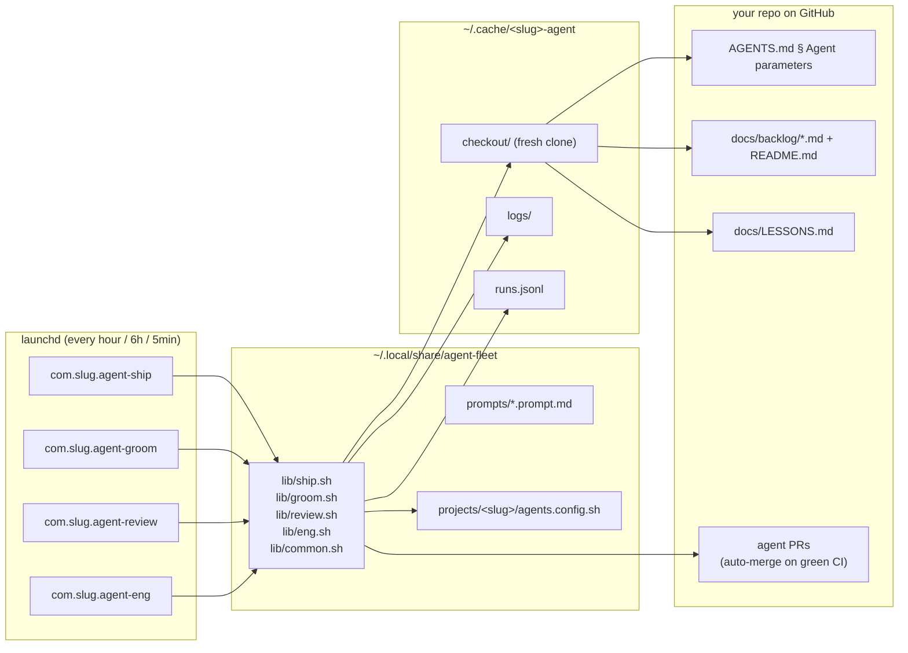

# agent-fleet

> **One shared engine. Many repos. Autonomous code shipping on a leash.**

`agent-fleet` is a tiny shell engine that turns any GitHub repository into a self-shipping codebase. Four `launchd` jobs (`ship`, `groom`, `review`, `eng`) fire on a schedule, each spawning the local `claude` CLI in a fresh checkout to do one thing: build the top backlog ticket, refresh the backlog, grade the resulting PR, or work the engineering queue. GitHub's auto-merge does the actual landing when CI is green.

The engine is **shared across every project** — semantics (gating checks, branch prefixes, voice, "do nots") live in each repo's own `AGENTS.md`. Fix the engine once, the whole fleet inherits it on next install.

> Sister project: **[fleet-control](https://github.com/mutaaf/fleet-control)** — the local web cockpit that shows what every agent is doing and lets you steer them from your phone.

---

## Table of contents

- [Why this exists](#why-this-exists)
- [Mental model in 60 seconds](#mental-model-in-60-seconds)
- [Prerequisites](#prerequisites)
- [Quickstart — adopt the fleet for an existing repo](#quickstart--adopt-the-fleet-for-an-existing-repo)
- [The four agents](#the-four-agents)
- [Anatomy of a single run](#anatomy-of-a-single-run)
- [The split: `agents.config.sh` vs `AGENTS.md`](#the-split-agentsconfigsh-vs-agentsmd)
- [Onboarding a brand-new repo (the long form)](#onboarding-a-brand-new-repo-the-long-form)
- [`bin/fleet` — the status dashboard](#binfleet--the-status-dashboard)
- [File layout — where everything lives on disk](#file-layout--where-everything-lives-on-disk)
- [Self-cancel — the kill switch](#self-cancel--the-kill-switch)
- [Cost model](#cost-model)
- [Uninstall](#uninstall)
- [Troubleshooting](#troubleshooting)
- [FAQ](#faq)
- [The Doctrine (D1–D12)](#the-doctrine-d1d12)
- [Repository layout](#repository-layout)

---

## Why this exists

Before the fleet, the same autonomous loop (`ship → groom → review`) had been hand-cloned into three repos. Each clone slowly drifted: one had a bug fix the others never got, one was running a slightly different prompt, one had silently stopped self-cancelling. Patches landed in one place and were forgotten in the others.

`agent-fleet` collapses all of that into one engine.

- **Plumbing is shared and parameterized.** `lib/*.sh` is identical for every project. It only reads a per-project `agents.config.sh` (slug, namespace, repo URL, cadence, kill date).
- **Semantics live in the repo.** Everything requiring judgement — gating CI checks, branch prefixes, the local "is it green?" command, hard rules, voice — lives in that repo's `AGENTS.md § Agent parameters` section, which `claude` reads from a fresh checkout at runtime.
- **Edit the engine once → whole fleet changes** on the next `install.sh` run.

---

## Mental model in 60 seconds



A scheduled `launchd` job runs a shell script from `~/.local/share/agent-fleet/lib/`. The script clones your repo fresh into `~/.cache/<slug>-agent/checkout/`, runs `claude --print` with the relevant prompt, reads your repo's `AGENTS.md` to learn what's allowed, and opens / heals / reviews / merges a PR. Nothing exotic — just shell + git + gh + claude.

---

## Prerequisites

| Requirement | Why | How |
|---|---|---|
| **macOS** | Uses `launchctl` for scheduling | Built-in |
| **`claude` CLI on a Max subscription** | All four agents shell out to `claude --print` | [claude.com/code](https://claude.com/code) |
| **`gh` CLI, authenticated** | PRs, reviews, merges, status checks | `brew install gh && gh auth login` |
| **Repo on GitHub with branch protection** | Auto-merge needs gating CI checks to wait on | Settings → Branches → require status checks |
| **A `main` branch** | All agent branches target `main` | — |

The fleet doesn't need API keys — it drives the local `claude` CLI, which talks to your Max subscription. Cost shows up on your Anthropic dashboard, not as a per-call bill.

---

## Quickstart — adopt the fleet for an existing repo

This assumes your repo already has tests, a CI workflow, and at least the start of a backlog (`docs/backlog/`). For a repo with none of that, jump to [Onboarding a brand-new repo](#onboarding-a-brand-new-repo-the-long-form).

**1. Clone the engine somewhere stable**

```bash
git clone https://github.com/mutaaf/agent-fleet ~/code/agent-fleet
```

**2. Drop a manifest in your repo**

```bash
cd /path/to/your-repo
cp ~/code/agent-fleet/manifest.example.sh agents.config.sh
$EDITOR agents.config.sh   # fill in SLUG, NAMESPACE, REPO_URL, SELF_CANCEL
```

**3. Add the `## Agent parameters` section to `AGENTS.md`**

```bash
cat ~/code/agent-fleet/templates/AGENTS.section.md >> AGENTS.md
$EDITOR AGENTS.md   # fill in the placeholders for your repo
```

**4. Commit those two files**

```bash
git add agents.config.sh AGENTS.md
git commit -m "wire up agent-fleet"
git push
```

**5. Install the launchd jobs**

```bash
bash ~/code/agent-fleet/lib/install.sh "$PWD"
```

You should see:

```
[OK] installed fleet agents for <slug> (com.<slug>.*):
       agent-ship    every hour at :41
       agent-groom   at :17 on hours [0 6 12 18]
       agent-review  every 5 min (polls; self-gates)
       agent-eng     at :23 on hours [3 9 15 21]   (only if ENG_ENABLED=1)
```

**6. Verify**

```bash
~/code/agent-fleet/bin/fleet status
```

Your project should appear with `installed=yes` and `SELF-CANCEL` showing days remaining.

The first ship run fires within the hour. To trigger one immediately:

```bash
launchctl kickstart -k "gui/$UID/com.<slug>.agent-ship"
```

…then tail the log:

```bash
tail -f ~/.cache/<slug>-agent/logs/ship-*.log
```

---

## The four agents

<table>
<tr><th>Agent</th><th>Cadence (default)</th><th>What it does</th><th>Branch prefix</th></tr>
<tr>
<td><b>ship</b></td>
<td>every hour at :41</td>
<td>Heals the currently-open feature PR if any, else picks the top backlog ticket and ships it.</td>
<td><code>feat/</code></td>
</tr>
<tr>
<td><b>groom</b></td>
<td>4×/day at :17</td>
<td>Re-ranks the backlog, rewrites vague tickets to the template, adds 2–4 fresh ideas, updates the index. Never touches <code>src/</code>.</td>
<td><code>chore/gtm-</code></td>
</tr>
<tr>
<td><b>review</b></td>
<td>every 5 min</td>
<td>Polls for unreviewed agent PRs. Grades each against AGENTS.md + Hard NOs and posts <code>--comment</code> (sign-off) or <code>--request-changes</code>. Never <code>--approve</code> (GitHub forbids self-approval).</td>
<td>n/a</td>
</tr>
<tr>
<td><b>eng</b> <em>(optional)</em></td>
<td>4×/day at :23</td>
<td>Parallel feature worker for engineering tickets (types, perf, test infra, dep hygiene). Independent PR gate; never blocks <code>ship</code>.</td>
<td><code>eng/</code></td>
</tr>
</table>

<details>
<summary><b>ship — the three phases of every run</b></summary>

Every ship invocation does the following, in order, and exits after the first one that produces work:

**Phase 1 — Heal an in-flight PR.** Lists open agent PRs, picks the lowest-numbered `feat/` one, and:
- **RED gating check** → Bounded recovery. Counts prior `heal:` commits on the branch. If ≥2 already, posts a human-asks comment and exits (don't loop forever). Otherwise: runs the local gate command from `AGENTS.md`, fixes the root cause, commits as `heal: <reason> (attempt K)`, pushes.
- **BEHIND** → `gh pr update-branch N`
- **DIRTY** (merge conflict) → Merges `origin/main`, resolves the obvious conflicts (backlog index, LESSONS.md), re-runs the local gate, pushes. Unresolvable conflicts get a comment and a skip.
- **PENDING** → Waits (CI is mid-flight).
- **All green, CLEAN** → `gh pr merge N --auto --squash` to arm auto-merge.

**Phase 2 — Ship the next ticket.** Only runs if Phase 1 found nothing. Walks `docs/backlog/README.md` in priority order, picks the first ticket whose file frontmatter says `status: groomed` (or `proposed`), and spawns the `implementation-dev` subagent. That subagent: branches `feat/<id>-<slug>`, marks the ticket in-progress, writes the failing test first, writes minimum code to pass, runs the local gate green, commits with the standard trailer, pushes, opens the PR with `gh pr create --fill`, arms `gh pr merge --auto --squash`. The ticket file + index get bumped to `status: shipped` only after the merge lands.

**Phase 3 — Learn.** If anything novel happened (a failure mode not already in `docs/LESSONS.md`), append a line. The append happens on the working branch — agents never push to `main` just to log.

**Exit summary** (one line, written to the log and the run record): `HEAL #N <action> | SHIP <ticket-id> | WAIT | NOOP` plus PR url, CI state, ticket id, status.
</details>

<details>
<summary><b>groom — housekeeping, self-gate, refresh</b></summary>

Runs four times a day at 0:17 / 6:17 / 12:17 / 18:17 UTC by default.

1. **Close stale groom PRs.** If more than one `chore/gtm-*` PR is open, close the older ones. If one is DIRTY, close it.
2. **Self-gate.** Count groomed P0/P1 tickets. If ≥ 3, exit immediately — the backlog is full, don't pile more work.
3. **Prune LESSONS.** Merge exact duplicates in `docs/LESSONS.md` (never delete live lessons).
4. **Spawn the `gtm-innovation` subagent.** It re-ranks all tickets, rewrites vague ones to the 4-lens template (Why now / User / Acceptance criteria / Risks), adds 2–4 fresh tickets (acquisition / retention / moat), updates `docs/backlog/README.md` to match.
5. **Ship it.** Branches `chore/gtm-YYYYMMDD-HHMM`, commits, pushes, `gh pr create`, `gh pr merge --auto --squash`.

**Hard constraints:** never edits `src/` or `tests/`, never runs the build, never force-pushes.
</details>

<details>
<summary><b>review — the independent grader</b></summary>

A continuous poller (default 5 min). The prompt is hardcoded in `lib/review.sh` rather than a separate file because the rubric is the same everywhere.

For each unreviewed agent PR (matched by branch prefix from `AGENTS.md` and absence of a review from the current user):

- Fetches PR metadata + diff into `/tmp/fleet-review/`.
- Checks out the PR branch on a detached HEAD in a separate `review-checkout/`.
- Runs `claude --print` with: the diff, the ticket file the PR claims to implement, AGENTS.md § Agent parameters, AGENTS.md § Hard NOs, docs/LESSONS.md, and `.claude/agents/review.md` (project rubric).
- Verdict: `clean` → `gh pr review N --comment "<sign-off>"` (non-blocking) **or** `blocking` → `gh pr review N --request-changes --body "<reasons>"` (blocks auto-merge until dismissed).
- **Never `--approve`**: GitHub forbids the PR author approving their own work, and the agent is configured as the author.
- Novel rubric-relevant lessons surface as `LESSON: …` lines in the review body so ship/groom can fold them in.

Runs that find no unreviewed PRs exit silently (`exit 0`, no log file). That's why `~/.cache/<slug>-agent/logs/` has many fewer review logs than ship logs even though review fires 12× more often.
</details>

<details>
<summary><b>eng — the optional second worker</b></summary>

Enabled per-project with `ENG_ENABLED=1` in `agents.config.sh`. Parallel to ship in every respect except:
- Consumes engineering tickets (types, performance, dep hygiene, test infra) instead of features.
- Branches `eng/<id>-<slug>`.
- Has its own single-PR gate — an open `eng/` PR never blocks `feat/` shipping and vice versa.
- Both still go to the same reviewer (one queue, one grader).

Useful when the engineering backlog is big enough that letting it fight with features for one ship slot per hour starves both.
</details>

---

## Anatomy of a single run

```mermaid
sequenceDiagram
    autonumber
    participant L as launchd<br/>(09:41 UTC)
    participant SH as lib/ship.sh
    participant CM as lib/common.sh
    participant GH as gh CLI
    participant CL as claude --print
    participant SUB as implementation-dev<br/>(subagent)
    participant DK as ~/.cache/&lt;slug&gt;-agent

    L->>SH: fires
    SH->>CM: fleet_load_manifest()
    CM-->>SH: SLUG, NAMESPACE, REPO_URL...
    SH->>CM: fleet_self_cancel()
    CM-->>SH: ok (or exit 0)
    SH->>CM: fleet_checkout "checkout"
    CM->>DK: clone --depth 20, hard reset to origin/main
    SH->>CL: pipe prompts/ship.prompt.md
    Note over CL: reads AGENTS.md § Agent parameters<br/>+ docs/LESSONS.md from fresh checkout
    CL->>GH: gh pr list (find open agent PRs)
    alt PR needs healing
        CL->>SUB: spawn for healing
        SUB->>GH: commit + push heal: ...
    else ship next ticket
        CL->>SUB: spawn implementation-dev for ticket NNNN
        SUB->>GH: branch, commit, push
        SUB->>GH: gh pr create --fill
        SUB->>GH: gh pr merge --auto --squash
    end
    CL-->>SH: JSON {session_id, total_cost_usd, result...}
    SH->>DK: append runs.jsonl + write logs/ship-TS.log
```

Everything is point-in-time: each run starts from a fresh clone, reads the latest `AGENTS.md` and `LESSONS.md`, and never assumes state carried over from the last run. The only persistent state inside the cache is the log archive and the cost record.

---

## The split: `agents.config.sh` vs `AGENTS.md`

This is the most important conceptual line in the project. **Get this wrong and the agents will be confused about who is in charge.**

| Lives in | Who reads it | What it says | Examples |
|---|---|---|---|
| `agents.config.sh` (your repo) | The **shell scripts** (`lib/*.sh`) | Identity, schedule, spend bound. Pure plumbing. | `SLUG`, `NAMESPACE`, `REPO_URL`, `SELF_CANCEL`, `SHIP_MINUTE`, `ENG_ENABLED` |
| `AGENTS.md § Agent parameters` (your repo) | **`claude`**, at runtime, from a fresh checkout | Gating CI checks, branch prefixes, the local gate command, subagent names, "hard NOs" (voice/privacy/security rules) | "Required checks: `lint`, `unit-tests`, `e2e-tests`", "Local gate: `npm run typecheck && npm run build && npx playwright test`", "Hard NO: no em-dashes in user-visible copy" |

The shell never reads `AGENTS.md`. The agent never reads `agents.config.sh`. Keeping the line clean lets you change runtime rules with a normal PR (no reinstall needed) while plumbing changes (e.g. a new cadence) only ever touch the manifest.

### `agents.config.sh` — full reference

```bash
# --- identity ---
PROJECT_NAME="Almanac"                                  # human label, logs only
SLUG="almanac"                                          # cache/log dir + filenames (must equal repo name)
NAMESPACE="com.almanac"                                 # launchd label prefix
REPO_URL="https://github.com/mutaaf/almanac"            # cloned into ~/.cache/<slug>-agent
MODEL="claude-opus-4-7"                                 # all agents, all phases

# Commits the agents author under this identity (your gh token still authorizes).
GIT_AUTHOR_NAME="Almanac Agent"
GIT_AUTHOR_EMAIL="noreply@anthropic.com"

# --- spend bound ---
# YYYYMMDD UTC. After this date all agents no-op until you bump it + reinstall.
# `fleet status` warns when this is within 3 days.
SELF_CANCEL="20260628"

# --- cadence ---
SHIP_MINUTE=41              # ship fires every hour at this minute
GROOM_HOURS="0 6 12 18"     # groom fires at GROOM_MINUTE on these hours (UTC)
GROOM_MINUTE=17
REVIEW_INTERVAL=300         # review poller period, seconds

# --- engineering queue (optional second worker) ---
ENG_ENABLED=0
ENG_HOURS="3 9 15 21"
ENG_MINUTE=23
```

### `AGENTS.md § Agent parameters` — what each repo defines

Copy `templates/AGENTS.section.md` into your `AGENTS.md` and fill in:

- **Required gating checks** — the exact GitHub Actions check names that gate a merge. The agent will only auto-merge when these are green.
- **Local gate command** — the shell command the agent runs locally before pushing to know it's likely green (e.g. `npm run typecheck && npm run build && npx playwright test`). Should be a strict superset or close match to CI.
- **Branch prefixes** — `feat/`, `chore/gtm-`, `eng/` are the defaults. Change if your repo conventions differ.
- **Subagents** — always `implementation-dev`, `gtm-innovation`, `review`; optionally `eng-dev` if `ENG_ENABLED=1`. Each is a `.claude/agents/*.md` file in your repo.
- **Backlog areas** — the area tags valid for tickets (e.g. `growth | retention | infra | privacy`).
- **Hard NOs** — repo-specific lines that auto-fail PR review if violated (banned words, privacy rules, emoji policy, etc.).

---

## Onboarding a brand-new repo (the long form)

About 10 minutes once you've done it twice. Reference: `DOCTRINE.md § 6`.

**Step 1. Manifest.** Copy and edit:
```bash
cp ~/code/agent-fleet/manifest.example.sh /path/to/repo/agents.config.sh
$EDITOR /path/to/repo/agents.config.sh
```
Tip: set `SELF_CANCEL` 3–4 weeks out for new projects so you naturally re-evaluate before it becomes a forever job.

**Step 2. `AGENTS.md`.** Create it if missing, then append the template:
```bash
cat ~/code/agent-fleet/templates/AGENTS.section.md >> /path/to/repo/AGENTS.md
$EDITOR /path/to/repo/AGENTS.md
```
Fill in the bracketed placeholders. Add a `## Hard NOs` section with anything you've been burned by before (privacy leaks, ugly UI patterns, banned phrases).

**Step 3. Backlog scaffolding.**
```bash
mkdir -p /path/to/repo/docs/backlog
cp ~/code/agent-fleet/templates/backlog/_template.md /path/to/repo/docs/backlog/
cat > /path/to/repo/docs/backlog/README.md <<'EOF'
# Backlog

| ID | Title | Status | Priority | Owner |
|---|---|---|---|---|
| 0001 | First ticket | proposed | P2 | gtm-innovation |
EOF
```

**Step 4. The validator.**
```bash
mkdir -p /path/to/repo/scripts
cp ~/code/agent-fleet/templates/scripts/check-backlog.mjs /path/to/repo/scripts/
```
Wire `node scripts/check-backlog.mjs` into your CI and your local gate command. It checks that every ticket file is in the index, every index row has a file, statuses are valid, and nothing has drifted.

**Step 5. Subagents.** Create `.claude/agents/` and copy templates:
```bash
mkdir -p /path/to/repo/.claude/agents
cp ~/code/agent-fleet/templates/claude-agents/eng-dev.md /path/to/repo/.claude/agents/
```
You'll need `implementation-dev.md`, `gtm-innovation.md`, `review.md`, and optionally `eng-dev.md`. Start from copies of any existing project's versions if you have one — the templates folder only ships the eng-dev shape today.

**Step 6. Install.**
```bash
bash ~/code/agent-fleet/lib/install.sh /path/to/repo
```

**Step 7. Verify.**
```bash
~/code/agent-fleet/bin/fleet status <slug>
```
Should show `installed=yes` (or `installed=3/3` / `4/4` if eng is on).

**Step 8. Trigger the first run manually so you don't have to wait an hour.**
```bash
launchctl kickstart -k "gui/$UID/com.<slug>.agent-ship"
tail -f ~/.cache/<slug>-agent/logs/ship-*.log
```

---

## `bin/fleet` — the status dashboard

```bash
~/code/agent-fleet/bin/fleet status            # all projects
~/code/agent-fleet/bin/fleet status courtiq    # just one
```

### Daily ops

```bash
~/code/agent-fleet/bin/fleet doctor                  # PASS/WARN/FAIL across every installed project
~/code/agent-fleet/bin/fleet doctor --slug courtiq   # one project
~/code/agent-fleet/bin/fleet doctor --json           # machine-readable, for fleet-control
~/code/agent-fleet/bin/fleet overview                # one-table cross-project pulse — SHIP/REVIEW/SENDBK/$TODAY/IN-FLIGHT/STATE
~/code/agent-fleet/bin/fleet weekly                  # Sunday ROI rollup over the trailing 7d — SHIPPED/$SPEND/DRAFTS↑/HEAL/INFRA/PAUSED/SELF-CANCEL
~/code/agent-fleet/bin/fleet tail                    # stream live events from every project (Ctrl-C to stop)
~/code/agent-fleet/bin/fleet rollback courtiq        # revert the last agent-shipped commit (revert/<id>-<slug> PR)
~/code/agent-fleet/bin/fleet kickstart courtiq ship             # trigger a one-shot agent-ship run
~/code/agent-fleet/bin/fleet kickstart courtiq ship --dry-run   # set AGENT_DRY_RUN=1 first, then kickstart
~/code/agent-fleet/bin/fleet replay courtiq --pr 17              # replay PR #17 through CURRENT prompts in dry-run (review by default; --phase ship to ask "what would the ship runner do?")
```

**Dry-run mode (ticket 0010).** Setting `AGENT_DRY_RUN=1` flips
`fleet_run_claude` into tool-locked mode — the prompt still runs end-to-end
(real claude call, real cost on `runs.jsonl`), but `--allowedTools none` is
appended so no commits, pushes, or `gh` calls happen. The runner emits
`run_dry_run plan_head=<first-200-chars-of-result>` to `events.jsonl`
instead of the usual `run_completed`, so downstream consumers can tell them
apart without scraping the log. The easiest way to trigger one is
`fleet kickstart <slug> <phase> --dry-run`, which prefixes the
`launchctl kickstart` with a `launchctl setenv AGENT_DRY_RUN 1`. Clear the
env when you're done dry-running: `launchctl unsetenv AGENT_DRY_RUN`.

Run `doctor` after upgrading the kit (`bash lib/install.sh ...`) or before a
long break. It validates each project's manifest, the AGENTS.md contract
section, the backlog scaffolding, launchd label load state, the installed-vs-
repo lib SHA, and `gh auth status` in one pass. Exit 0 = all green; exit 1 =
at least one FAIL across the fleet. Set `FLEET_DISCOVERY_ROOT` to override the
scan root (defaults to `~/Desktop/projects`).

Discovery scans two roots:
- `~/Desktop/projects/*/agents.config.sh` (active working trees)
- `~/.local/share/agent-fleet/projects/*/agents.config.sh` (installed manifests)

…and dedupes by `SLUG`. So even if you've deleted the working tree, an installed project still shows up.

Example output:

```
PROJECT       INSTALLED   LAST RUN     PRS   LESSONS   SELF-CANCEL
─────────────────────────────────────────────────────────────────────
almanac       yes         3m ago       2     47        42d   20260706
courtiq       3/4         1h ago       —     33        21d   20260615
digitalcraft  yes         6h ago       1     55        EXPIRED  20260520
```

| Column | Meaning |
|---|---|
| `PROJECT` | `SLUG` from manifest |
| `INSTALLED` | `yes` (all expected jobs loaded), `N/expected` (some missing), or `no` |
| `LAST RUN` | Age of newest file in `~/.cache/<slug>-agent/logs/` |
| `PRS` | Open agent PRs by branch prefix (`—` if `gh` unauthenticated) |
| `LESSONS` | Line count of `docs/LESSONS.md` (cheap signal of how much the project has learned) |
| `SELF-CANCEL` | Days remaining (red if expired, yellow if ≤ 3) + the YYYYMMDD date |

---

## File layout — where everything lives on disk

```
~/.local/share/agent-fleet/          # the installed engine (TCC-safe)
├── lib/                              # ship.sh / groom.sh / review.sh / eng.sh
│   ├── common.sh                     # fleet_load_manifest, fleet_self_cancel,
│   │                                 # fleet_checkout, fleet_run_claude
│   ├── install.sh / uninstall.sh
│   └── ...
├── prompts/                          # ship.prompt.md, groom.prompt.md, eng.prompt.md
│                                     # (review prompt is inline in review.sh)
└── projects/
    └── <slug>/
        └── agents.config.sh          # per-project manifest (a copy)

~/Library/LaunchAgents/
├── com.<slug>.agent-ship.plist
├── com.<slug>.agent-groom.plist
├── com.<slug>.agent-review.plist
└── com.<slug>.agent-eng.plist        # only if ENG_ENABLED=1

~/.cache/<slug>-agent/                # per-project runtime workspace
├── checkout/                         # fresh clone for ship/groom
├── review-checkout/                  # fresh clone for review (fetches PR branches)
├── eng-checkout/                     # fresh clone for eng
├── logs/
│   ├── ship-20260525-094103.log
│   ├── groom-20260525-061702.log
│   ├── review.err                    # only written for quiet failures
│   └── launchd-ship.{out,err}        # launchd's own capture
└── runs.jsonl                        # structured cost record, one JSON per run

# Inside YOUR repo:
<repo>/
├── AGENTS.md                         # § Agent parameters + § Hard NOs
├── agents.config.sh                  # manifest (the plumbing copy lives in the kit too)
├── docs/
│   ├── LESSONS.md                    # append-only operational memory
│   └── backlog/
│       ├── README.md                 # index (ordering truth)
│       ├── _template.md              # the 4-lens ticket template
│       └── NNNN-slug.md              # ticket files (status truth, validated by CI)
├── scripts/
│   └── check-backlog.mjs             # gates merges on backlog drift
└── .claude/agents/
    ├── implementation-dev.md         # feature subagent
    ├── gtm-innovation.md             # backlog refresh subagent
    ├── review.md                     # PR grading rubric
    └── eng-dev.md                    # engineering subagent (if ENG_ENABLED)
```

Why is the engine in `~/.local/share/` and not, say, `~/code/agent-fleet/`? **TCC**. macOS's privacy framework requires explicit Full Disk Access for processes that read from `~/Desktop` and similar locations. `launchd` jobs that point at scripts under `~/Desktop` get blocked silently. `~/.local/share/` is never gated. `install.sh` copies the engine there so the jobs always work.

---

## Self-cancel — the kill switch

Every project has a `SELF_CANCEL="YYYYMMDD"` line in its manifest. Every run starts with this check:

```bash
fleet_self_cancel() {
  local today; today=$(date -u +%Y%m%d)
  if [ "$today" -ge "$SELF_CANCEL" ]; then
    echo "expired — ${SLUG} agents reached self-cancel ($SELF_CANCEL)."
    echo "Bump SELF_CANCEL in agents.config.sh, then re-run: bash <kit>/lib/install.sh <project-dir>"
    return 1
  fi
  return 0
}
```

If the date has passed, the run logs one line and exits 0. **The launchd jobs keep firing**, but they no-op. This is intentional: it gives you natural friction to re-evaluate ("do I still want this running?") rather than letting an autonomous loop drift on forever because you forgot about it.

**To extend** a project past its kill date:
```bash
$EDITOR /path/to/repo/agents.config.sh   # bump SELF_CANCEL=YYYYMMDD
bash ~/code/agent-fleet/lib/install.sh /path/to/repo
```

`fleet status` shows days remaining and warns yellow at ≤ 3 days, red at ≤ 0.

---

## Cost model

Doctrine D11: **local `claude` CLI on the Max subscription, no API keys in repos, no remote per-session billing.**

Each `fleet_run_claude` call writes one line to `~/.cache/<slug>-agent/runs.jsonl`:

```json
{
  "slug": "almanac",
  "phase": "ship",
  "ts_start": "2026-05-25T09:41:00Z",
  "ts_end": "2026-05-25T09:47:23Z",
  "exit": 0,
  "model": "claude-opus-4-7",
  "session_id": "...",
  "total_cost_usd": 0.42,
  "duration_ms": 383000,
  "num_turns": 3,
  "usage": { "input_tokens": "...", "output_tokens": "..." },
  "result_head": "SHIP 0042-user-acquisition — PR #187 green..."
}
```

These records are what [fleet-control](https://github.com/mutaaf/fleet-control) ingests to render the cost board. The Max plan means `total_cost_usd` represents relative effort more than a literal invoice — but it's still the right signal for "which project is burning the most context."

---

## Uninstall

**Remove from one project:**
```bash
bash ~/code/agent-fleet/lib/uninstall.sh /path/to/repo
```

This boots out the launchd jobs and removes the plists. Logs and the manifest copy stay where they are. To wipe completely:

```bash
rm -rf ~/.cache/<slug>-agent
rm -rf ~/.local/share/agent-fleet/projects/<slug>
```

**Remove the engine itself:**
```bash
# uninstall every project first, then:
rm -rf ~/.local/share/agent-fleet
rm -rf ~/code/agent-fleet   # if you cloned it there
```

`launchd` jobs that point at scripts that no longer exist will fail loudly on next fire — uninstall first, delete second.

---

## Troubleshooting

<details>
<summary><b>The launchd job never fires</b></summary>

```bash
launchctl print "gui/$UID/com.<slug>.agent-ship" | head -40
```
Look for `state = waiting` (good — will fire on schedule) vs `state = not running` with errors. Common causes:
- The script path in the plist points somewhere TCC blocks. Reinstall (`install.sh`) — it copies to `~/.local/share/` which is safe.
- Plist syntax error. `plutil ~/Library/LaunchAgents/com.<slug>.agent-ship.plist` will tell you.
</details>

<details>
<summary><b>The job fires but exits immediately</b></summary>

Check the log:
```bash
tail -50 ~/.cache/<slug>-agent/logs/launchd-ship.err
tail -50 ~/.cache/<slug>-agent/logs/ship-*.log | tail -50
```
Most likely:
- `SELF_CANCEL` has passed. You'll see "expired — ... reached self-cancel". Bump the date and reinstall.
- `gh` is not authenticated. Run `gh auth status`. The agent needs PR read/write.
- The repo URL in `agents.config.sh` is wrong. The clone will have failed in `fleet_checkout`.
</details>

<details>
<summary><b>The PR opens but never merges</b></summary>

The agent armed `--auto --squash` but a required check is missing or red.

```bash
gh pr view <N> --json statusCheckRollup,mergeStateStatus
```
- `mergeStateStatus: BLOCKED` and rollup shows a red check → ship will pick it up on the next hour and try to heal (≤ 2 attempts before posting a human-asks comment).
- `mergeStateStatus: BEHIND` → ship will rebase on the next fire.
- `mergeStateStatus: CLEAN` and no merge → branch protection is missing the auto-merge allow. Go to repo Settings → General → "Allow auto-merge".
</details>

<details>
<summary><b>Review never grades a PR</b></summary>

Check:
```bash
ls -la ~/.cache/<slug>-agent/logs/review-*.log 2>/dev/null
```
- If empty: review found no unreviewed PRs (that's the silent-success path). Make sure your PR was authored by a different identity than the one configured as the reviewer (GitHub forbids self-review).
- If logs exist with errors: the PR's branch prefix probably doesn't match the regex in `AGENTS.md § Agent parameters`. The default is `^(feat/|chore/gtm-|eng/)`.
</details>

<details>
<summary><b>Two ship runs landed at the same time and stomped each other</b></summary>

Shouldn't happen — `launchctl` won't double-fire the same label. If you see overlap, something kicked one off manually (`launchctl kickstart`) while another was mid-flight. The fresh-checkout model means they can't corrupt each other's working tree, but they can race on the same PR. Wait for one to finish (or `launchctl kill SIGTERM gui/$UID/com.<slug>.agent-ship`) then let the schedule resume.
</details>

<details>
<summary><b>I see "checkout failed" in the log</b></summary>

Usually one of:
- `REPO_URL` in `agents.config.sh` is wrong or private without an auth token in `gh`.
- The cache directory is corrupt. `rm -rf ~/.cache/<slug>-agent/checkout` and let the next run re-clone.
- Disk full. `df -h ~/.cache`.
</details>

---

## FAQ

**Why shell scripts and not Python / Node?** Zero install footprint. Every macOS already has `bash`, `git`, `curl`. The engine has no dependency tree to drift, no `node_modules` to invalidate, no virtualenv to break. The only "runtime" is the `claude` and `gh` CLIs, which you need anyway.

**Why `launchd` and not `cron`?** `launchd` is the macOS-native scheduler, survives reboots cleanly, and gives you `launchctl print`, `launchctl kickstart`, and per-job log redirection without ceremony. `cron` on macOS is fine but ungoverned and harder to introspect.

**Why one engine and not just better template files?** Because templates drift. The first project to need a fix gets it; the others stay broken. Sharing the engine means a fix lands once and benefits everyone on next install.

**Why does claude read `AGENTS.md` from a fresh checkout each run instead of from the manifest?** Two reasons. First, it lets you change runtime rules with a normal PR (no `install.sh` needed). Second, it keeps the agent honest about what the repo actually says today — not what the manifest said when last installed.

**Can the agents push to `main` directly?** No. Hard rule. Every change goes through a `feat/` / `chore/gtm-` / `eng/` PR, gets graded by review, merges only when CI is green via `--auto --squash`.

**What model do the agents use?** Whatever you set `MODEL=` to in the manifest. Defaults to `claude-opus-4-7` because the work (planning a ticket end-to-end, reading a diff for subtle issues, healing a CI failure) benefits from the strongest reasoning. You can run a project on Sonnet by setting `MODEL="claude-sonnet-4-6"` if you want to test cost trade-offs.

**Does the eng agent compete with the ship agent for the same backlog?** No. They consume disjoint queues (feature tickets vs engineering tickets — they're filtered by area tag and branch prefix). Each runs an independent single-PR gate, so neither blocks the other.

**Why does review never `--approve`?** GitHub doesn't allow the author of a PR to approve their own PR, and the agent is configured as the author. `--comment` (sign-off) and `--request-changes` (gate) are the two it can use.

**Where do new lessons come from?** Two paths. (1) The ship agent appends one when it hits a novel failure during healing. (2) The review agent surfaces a `LESSON:` line in its review body when it spots a recurring failure mode. Ship/groom pick those up on their next run.

**What's the difference between this and a CI-only autonomous agent (like an action that runs on PR open)?** Cadence and statefulness. CI agents only react to events; the fleet's scheduled cadence means it picks up the next ticket on its own and heals stale PRs without anyone touching the repo.

---

## The Doctrine (D1–D12)

See [`DOCTRINE.md`](./DOCTRINE.md) for the full text. The 12 canonical decisions, summarized:

| # | Decision |
|---|---|
| D1 | Backlog = ticket files + index + validator (drift-proof) |
| D2 | Specs = 4-lens "Why now" + test-shaped acceptance criteria |
| D3 | Feature queue required; engineering queue optional (`ENG_ENABLED`) |
| D4 | Two-stage review: cheap self-check by worker, independent grader for the gate |
| D5 | GitHub auto-merge does the landing; the reviewer votes but doesn't merge |
| D6 | Self-heal bounded to ≤ 2 attempts per PR before escalation |
| D7 | `AGENTS.md` (singular) is the contract file |
| D8 | Cadence: ship :41, groom 6h :17, review 5m, eng 6h :23 |
| D9 | Naming: `com.<slug>.agent-*` (slug = repo name) |
| D10 | Spend bound via `SELF_CANCEL`; `fleet status` warns ≤ 3 days out |
| D11 | Local `claude` CLI on Max plan, no API keys in repos |
| D12 | `claude-opus-4-7` is the default model for every agent |

---

## Repository layout

```
agent-fleet/
├── README.md               # you are here
├── DOCTRINE.md             # the 12 canonical decisions, with rationale
├── MIGRATION.md            # how older per-repo loops were converged onto the kit
├── manifest.example.sh     # copy this to <your-repo>/agents.config.sh
├── lib/                    # the shared engine (bash)
│   ├── common.sh           # fleet_load_manifest, _self_cancel, _checkout, _run_claude
│   ├── ship.sh             # the ship agent (3 phases)
│   ├── groom.sh            # the groom agent (backlog refresh)
│   ├── review.sh           # the review agent (PR grading, prompt inline)
│   ├── eng.sh              # the optional eng agent
│   ├── install.sh          # copy engine + generate launchd plists
│   └── uninstall.sh        # bootout launchd jobs, rm plists
├── prompts/
│   ├── ship.prompt.md
│   ├── groom.prompt.md
│   └── eng.prompt.md
├── bin/
│   └── fleet               # the status dashboard CLI
└── templates/
    ├── AGENTS.section.md           # paste into your AGENTS.md
    ├── backlog/_template.md        # the 4-lens ticket template
    ├── scripts/check-backlog.mjs   # the validator (wire into CI)
    └── claude-agents/
        └── eng-dev.md              # subagent template (start point for the others)
```

---

## License

Personal toolkit. Use it, fork it, learn from it. No warranty.
